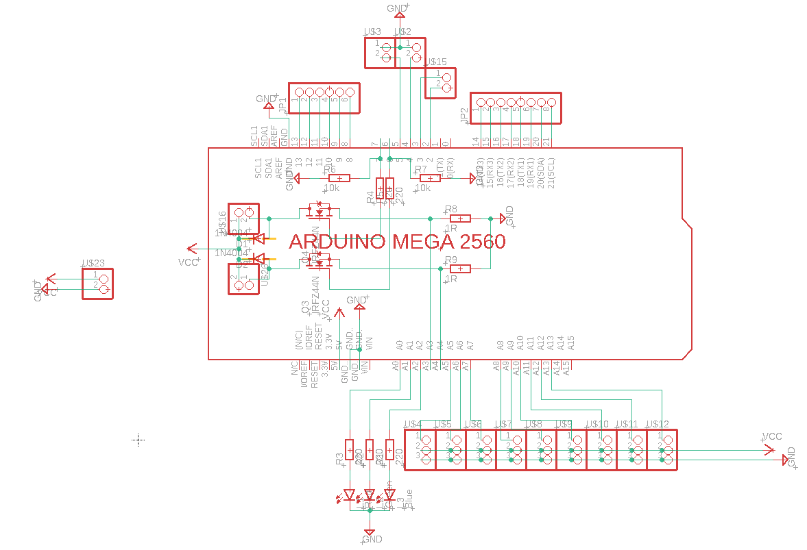
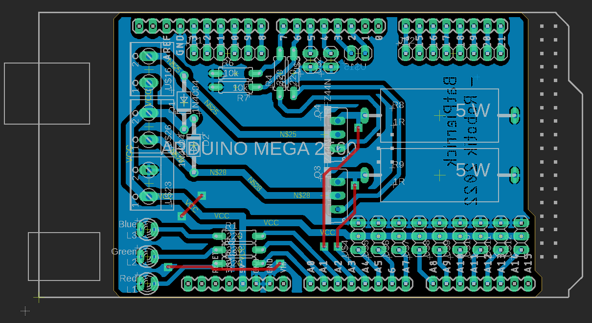
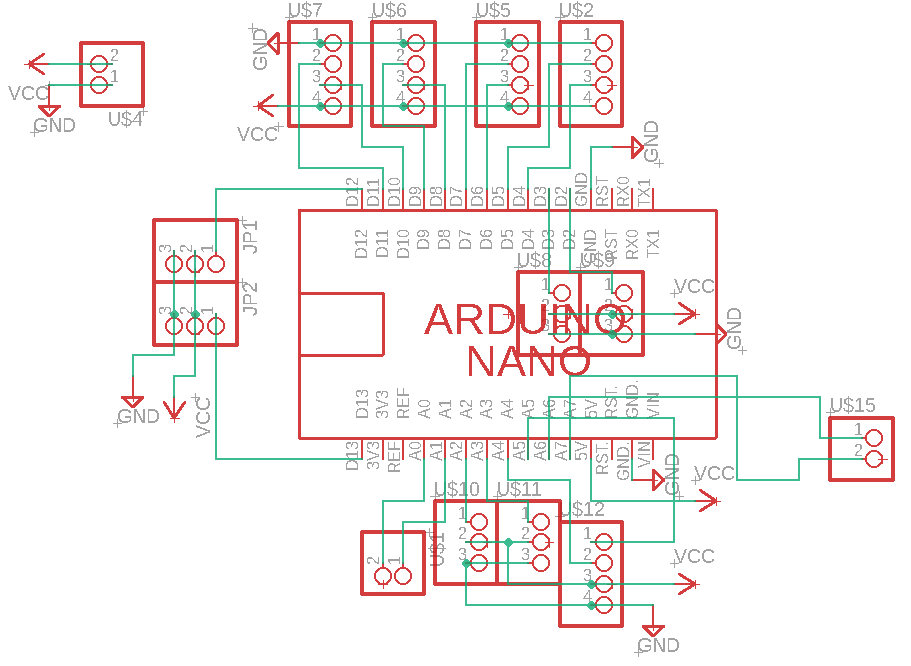
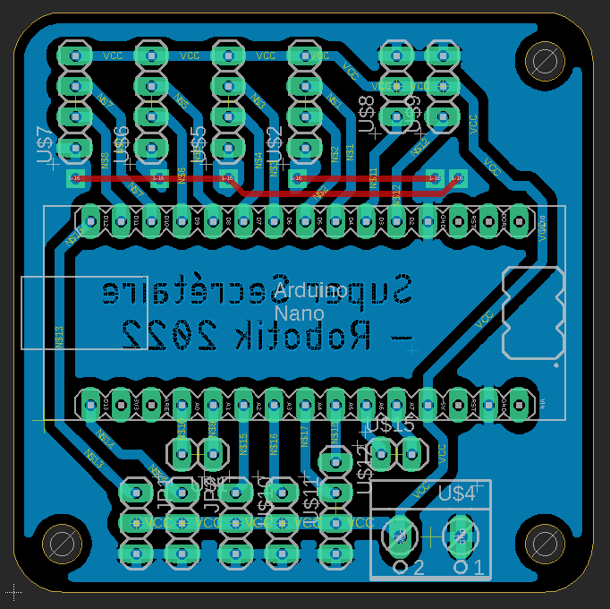
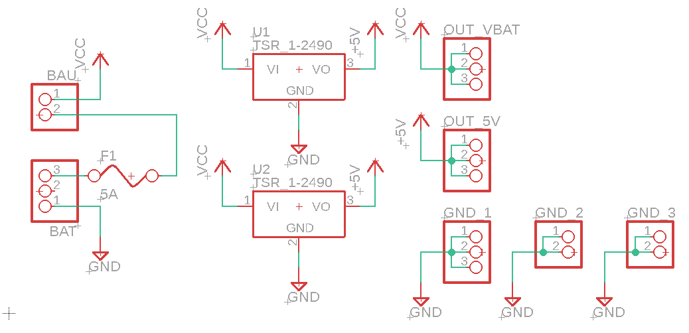
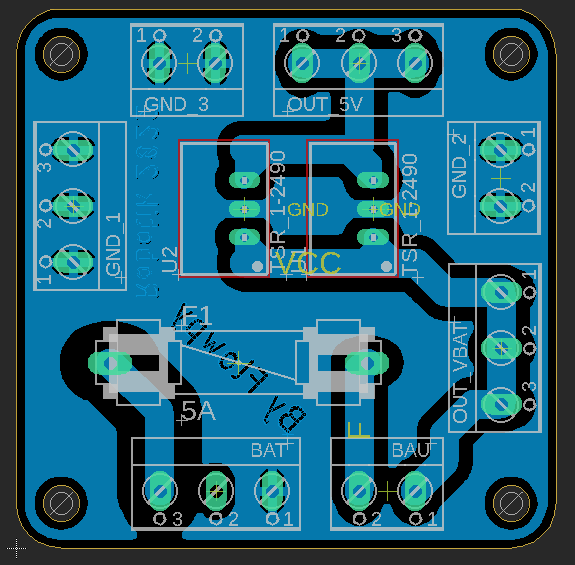

# Elec-2022_Cartes_GR

Circuits imprimés pour le Gros Robot de la Coupe de France de Robotique 2022

## PCB Arduino Mega (PCB_Mega)
Shield pour Arduino Mega 2560.
Alimentée en 5V par un bornier à vis.

**Comprends :**
- Port série pour la communication avec la Nano
- Ports séries Servos (XL320 + AX-12A)
- Sorties logiques moteurs roues
- Sorties pompes à vide
- Entrées Roues Codeuses
- Entrées analogiques courant pompes à vide
- Entrées Tirette et Interrupteur de sélection du côté
- Leds de Status Rouge, Verte et Bleue
- 10 GPIO supplémentaires non-utilisés

___

## PCB Arduino Nano (PCB_Nano)
Module hôte pour Arduino Nano.
Alimentée en 5V par un bornier à vis.

**Comprends :**
- Port série pour communication avec la Mega
- Port I2C pour écran LCD
- Entrées/Sorties Echos et Triggers pour les sonars
- 6 GPIO supplémentaires non-utilisés

## PCB Alimentation (PCB_Power)
Module d'alimentation pour le Gros Robot.

**Rails fournis :**
- 5V (2A max) : Arduinos Mega et Nano, pompes à vide et écran LCD.
- Vbat : Moteurs roues et modules Step-Down pour les Servos
(Vbat correspond à Bat+ en série avec un Fusible de 5A et le BAU)

**Comprends :**
- Connecteur arrivée de la batterie (Bat+/Bat-)
- Connecteur Bouton Arrêt d'Urgence (BAU)
- 3 sorties Vbat
- 3 sorties 5V
- 7 sorties GND (<=> Bat-)

___

## Screenshots

### PCB_Mega

### PCB_Nano

### PCB_Power

